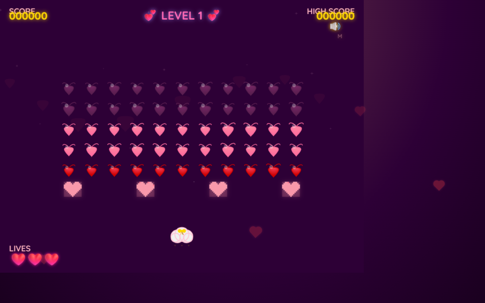

# 💕 Love Invaders

A Valentine's Day themed browser-based arcade shooter inspired by Space Invaders. Control Cupid and shoot love arrows at descending hearts in this romantic twist on the classic arcade game.




## 📑 Table of Contents

- [Game Description](#-game-description)
- [Features](#-features)
- [How to Run Locally](#-how-to-run-locally)
- [Controls](#-controls)
- [Technology Stack](#️-technology-stack)
- [Documentation](#-documentation)
- [Valentine's Theme](#-valentines-theme)
- [Scoring](#-scoring)
- [Win & Lose Conditions](#-win--lose-conditions)
- [Game Features](#-game-features)
- [Troubleshooting](#️-troubleshooting)
- [Learning Resources](#-learning-resources)
- [Deployment](#-deployment)
- [Credits](#-credits)

---

## 🎮 Game Description

Love Invaders puts you in control of Cupid's cloud, tasked with capturing the hearts of a descending valentine grid. Shoot love arrows, dodge falling kisses, and hide behind love letter shields as you progress through increasingly challenging levels. With procedurally generated graphics and synthesized audio, this lightweight game runs entirely in the browser with no asset loading required.

### 🎯 Features

- **Classic Arcade Gameplay** - Faithful recreation of Space Invaders mechanics with a romantic theme
- **Progressive Difficulty** - Enemies speed up as you destroy them and with each level
- **Multiple Enemy Types** - Three rows of hearts with different point values (10, 20, 30 points)
- **Bonus Enemies** - Special items (rings, chocolates, love letters) worth 100-300 points
- **Destructible Shields** - Four love letter shields that degrade with damage
- **Particle Effects** - Hearts and sparkles burst when enemies are hit
- **Synthesized Audio** - 8-bit style sounds generated using Web Audio API
- **High Score Persistence** - Local storage saves your best score
- **Responsive Design** - Canvas scales to fit your browser window
- **Level Progression** - Infinite levels with increasing challenge

## 🚀 How to Run Locally

Love Invaders is a static web application that requires only a simple HTTP server. You cannot run it by opening `index.html` directly due to browser security restrictions on ES6 modules.

### Quick Start Options

**Option 1: Python (Recommended)**
```bash
# Python 3
python -m http.server 8000

# Python 2
python -m SimpleHTTPServer 8000
```

**Option 2: Node.js (http-server)**
```bash
npx http-server -p 8000
```

**Option 3: VS Code Live Server**
1. Install the "Live Server" extension
2. Right-click `index.html`
3. Select "Open with Live Server"

**Option 4: Node.js (custom server)**
```bash
npx serve
```

After starting the server, open your browser to:
```
http://localhost:8000
```

## 🎯 Controls

| Action | Keys | Description |
|--------|------|-------------|
| **Move Left** | `←` or `A` | Move Cupid's cloud left |
| **Move Right** | `→` or `D` | Move Cupid's cloud right |
| **Shoot** | `Space`, `W`, or `↑` | Fire a love arrow |
| **Pause** | `P` | Pause/unpause the game |
| **Restart** | `Enter` | Restart game (Game Over screen only) |

### 💡 Tips
- You can only have one arrow on screen at a time (classic Space Invaders style)
- Shields protect you but take damage from both your arrows and enemy projectiles
- Aim for top row hearts (purple) for maximum points
- Watch for bonus items - they're worth 100-300 points!
- Hearts speed up as you destroy more of them

## 🛠️ Technology Stack

- **HTML5 Canvas** - All rendering is procedural (no sprite images)
- **Vanilla JavaScript** - Pure ES6 modules, no frameworks
- **Web Audio API** - Real-time synthesized sound effects
- **LocalStorage API** - Persistent high score tracking

**Why no frameworks?** This project demonstrates that modern web APIs are powerful enough to create polished games without additional dependencies. The entire codebase is under 50KB!

## ⚠️ Troubleshooting

### Audio Not Playing

**Problem**: No sound effects play when the game starts.

**Solution**: Most browsers require a user interaction before allowing audio playback. The game attempts to enable audio when you press any key to start, but if audio still doesn't work:

1. Click anywhere on the game canvas
2. Press any key
3. Refresh the page and try again

If audio still doesn't work, check:
- Browser console for errors (`F12` → Console tab)
- Browser audio isn't muted (check browser tab icon)
- System volume is up

### Module Loading Errors

**Problem**: Browser console shows "Cannot use import statement outside a module" or CORS errors.

**Solution**: You must run the game through an HTTP server, not by opening `index.html` directly as a file. See [How to Run Locally](#-how-to-run-locally) above.

### Canvas Not Responsive

**Problem**: Game canvas doesn't resize with browser window.

**Solution**: The canvas automatically resizes, but you may need to refresh the page if it gets stuck. The resize system maintains aspect ratio and updates game dimensions in real-time.

### Game Feels Too Fast/Slow

**Problem**: Game difficulty feels off.

**Solution**: All gameplay constants can be adjusted in `src/game/config.js`:
- `PLAYER_CONFIG.SPEED` - Player movement speed
- `ENEMY_CONFIG.BASE_SPEED` - Enemy horizontal movement
- `ENEMY_CONFIG.BASE_FIRE_RATE` - How often enemies shoot
- `LEVEL_CONFIG.SPEED_INCREASE` - Difficulty scaling per level

## 🛠️ Customization & Development

### Easy Tweaks (No Code Required)

Edit `src/game/config.js` to customize gameplay:

```javascript
// Make player faster
PLAYER_CONFIG.SPEED: 350  // Default: 250

// Give more lives
PLAYER_CONFIG.STARTING_LIVES: 5  // Default: 3

// Make enemies slower
ENEMY_CONFIG.BASE_SPEED: 20  // Default: 30

// Easier difficulty progression
LEVEL_CONFIG.SPEED_INCREASE: 0.10  // Default: 0.15 (15%)

// Change point values
ENEMY_CONFIG.POINTS: {
    red: 20,    // Default: 10
    pink: 40,   // Default: 20
    purple: 60  // Default: 30
}
```

### Color Customization

Edit color constants in `src/render/draw.js`:

```javascript
const COLORS = {
    midnightRomance: '#2D0036',  // Background
    passionRed: '#FF4D6D',        // Red enemies
    sweetPink: '#FF8FA3',         // Pink enemies
    blushPink: '#FFC4D6',         // Purple enemies
    cupidGold: '#FFD700',         // Player
    paperWhite: '#F0F0F0',        // Shields
    deepPurple: '#7B2869'         // UI
};
```

### Adding New Features

**See [ARCHITECTURE.md](docs/ARCHITECTURE.md) Extension Points section** for detailed guides on:
- Adding new enemy types
- Creating new bonus items
- Implementing power-ups
- Adding difficulty modes
- Creating new level mechanics

### Project Structure Deep Dive

```
src/
├── main.js                 # 🎮 Game orchestration and main loop
├── audio/
│   └── audio.js           # 🔊 Web Audio API sound synthesis
├── canvas/
│   └── resize.js          # 📐 Responsive canvas management
├── game/
│   ├── bonus.js           # 💎 Special bonus item system
│   ├── collisions.js      # 💥 AABB collision detection
│   ├── config.js          # ⚙️ All gameplay constants (EDIT THIS!)
│   ├── enemies.js         # 👾 Enemy grid logic and movement
│   ├── enemyFire.js       # 🔫 Enemy shooting system
│   ├── entities.js        # 📦 Entity factory and management
│   ├── input.js           # ⌨️ Keyboard input handling
│   ├── levels.js          # 📈 Level progression and difficulty
│   ├── loop.js            # ⏱️ Game loop (requestAnimationFrame)
│   ├── particles.js       # ✨ Particle effects system
│   ├── player.js          # 🚀 Player movement and shooting
│   ├── projectiles.js     # 🎯 Projectile physics
│   ├── scoring.js         # 🏆 Score and high score tracking
│   ├── shields.js         # 🛡️ Destructible shield generation
│   └── state.js           # 🎛️ Game state machine
└── render/
    ├── draw.js            # 🎨 Drawing functions for all entities
    └── sprites.js         # 🖌️ Procedural shape definitions
```

**Each file is self-contained and well-commented** - open any file to see what it does!

## 📖 Documentation

Comprehensive documentation is available in the `docs/` folder:

### For Players
- **[README.md](README.md)** - This file! Game overview, controls, and how to play

### For Developers
- **[ARCHITECTURE.md](docs/ARCHITECTURE.md)** - 📐 Complete technical architecture, system design, and data flow
- **[spec.md](docs/spec.md)** - Game specification including mechanics, scoring, and controls
- **[CREDITS.md](docs/CREDITS.md)** - 🙏 Credits, acknowledgments, and technology stack details

### Implementation Details
- **[game-logic-complete.md](docs/game-logic-complete.md)** - Implementation details and game logic verification
- **[level-progression-implementation.md](docs/level-progression-implementation.md)** - Level system design and difficulty scaling
- **[theme.md](docs/theme.md)** - Valentine's theme design and visual style guide
- **[coordinate-system.md](docs/coordinate-system.md)** - Canvas coordinate system and positioning

**New to the codebase?** Start with [ARCHITECTURE.md](docs/ARCHITECTURE.md) for a complete technical overview!

## 🎨 Valentine's Theme

Love Invaders uses a carefully crafted Valentine's color palette:

- **Midnight Romance** (`#2D0036`) - Deep purple background
- **Passion Red** (`#FF4D6D`) - Bottom row hearts
- **Sweet Pink** (`#FF8FA3`) - Middle row hearts  
- **Blush Pink** (`#FFC4D6`) - Top row hearts
- **Cupid Gold** (`#FFD700`) - Player and projectiles
- **Paper White** (`#F0F0F0`) - Shield envelopes

All graphics are rendered procedurally using Canvas API bezier curves and geometric primitives - no sprite images required!

## 🏆 Scoring

| Target | Points | Notes |
|--------|--------|-------|
| **Red Hearts** (bottom row) | 10 | Easiest to hit |
| **Pink Hearts** (middle rows) | 20 | Medium difficulty |
| **Purple Hearts** (top rows) | 30 | Hardest to reach |
| **Bonus Items** | 100-300 | Random value, appears periodically |

**Maximum Score Per Level:**
- Red row: 11 × 10 = 110 points
- Pink rows: 22 × 20 = 440 points
- Purple rows: 22 × 30 = 660 points
- **Total: 1,210 points** (plus bonuses!)

## 🎯 Win & Lose Conditions

### How to Win
- **Destroy all 55 hearts** in the enemy grid
- Automatically advances to the next level
- Score and lives are preserved
- Difficulty increases with each level

### How to Lose
1. **Lives Depleted** - Get hit by 3 enemy projectiles
2. **Enemy Invasion** - Any heart reaches your position at the bottom

## 🎨 Game Features

### Visual Effects
- **Particle System** - Hearts and sparkles burst when enemies are destroyed
- **Smooth Animations** - Enemies pulse and scale dynamically
- **Screen Shake** - Subtle effects for impacts (if implemented)
- **Invincibility Flicker** - Visual feedback when player is temporarily invincible

### Audio System
- **8-bit Style** - Retro synthesized sounds using Web Audio API
- **Dynamic Music** - Background ambience (if implemented)
- **Contextual SFX** - Different sounds for different events:
  - Shooting arrows
  - Enemy hits and explosions
  - Player damage
  - Level complete fanfare
  - Bonus item collection
  - Shield impacts

### Progression System
- **Infinite Levels** - Play as long as you can survive!
- **Dynamic Difficulty** - Enemies speed up as you destroy them (heartbeat effect)
- **Per-Level Scaling** - 15% speed increase + increased fire rate each level
- **Challenge Curve** - Starts approachable, becomes intense by level 5+

## 🎓 Learning Resources

Want to understand how the game works or build your own?

### Start Here
1. **[ARCHITECTURE.md](docs/ARCHITECTURE.md)** - Complete system architecture and technical overview
2. **[spec.md](docs/spec.md)** - Game design specification
3. **Explore src/** - Well-commented, modular code

### Key Concepts Demonstrated
- **Game Loop Design** - Delta time, update/render separation
- **Entity Management** - Flexible entity-component patterns
- **State Machines** - Clean state transitions
- **Collision Detection** - AABB (Axis-Aligned Bounding Box)
- **Procedural Graphics** - Canvas API bezier curves and shapes
- **Audio Synthesis** - Web Audio API oscillators and gain nodes
- **Responsive Design** - Canvas scaling and resize handling

### Code Highlights
- `src/game/loop.js` - Clean game loop implementation
- `src/game/state.js` - State machine pattern
- `src/render/sprites.js` - Procedural shape drawing
- `src/audio/audio.js` - Sound synthesis
- `src/game/collisions.js` - Collision detection algorithms

## 🚀 Deployment

### Quick Deploy to GitHub Pages

```bash
# 1. Push to GitHub
git add .
git commit -m "Deploy Love Invaders"
git push origin main

# 2. Enable GitHub Pages
# Go to: Repository Settings → Pages → Source: main branch → Save

# 3. Your game is live!
# https://yourusername.github.io/repository-name/
```

### Other Hosting Options
- **Netlify** - Drag and drop the folder
- **Vercel** - Import from GitHub
- **Any HTTP Server** - No build process required!

## 📝 License

This is a demonstration project created for educational purposes. Inspired by the classic **Space Invaders** (1978) by Tomohiro Nishikado.

Feel free to learn from, modify, and extend this code for your own projects!

## 🙏 Credits

### Game Design
- **Original Inspiration:** Space Invaders (1978) by Tomohiro Nishikado / Taito Corporation
- **Theme:** Valentine's Day romantic twist on classic arcade gameplay

### Technologies
- **HTML5 Canvas API** - All rendering (procedural graphics)
- **Web Audio API** - Real-time sound synthesis
- **Vanilla JavaScript** - ES6 modules, no frameworks
- **Google Fonts** - Typography (Pacifico, Dancing Script, Great Vibes, Quicksand)

### Development
Built using **multi-agent orchestration** with GitHub Copilot, demonstrating collaborative AI-assisted development workflow.

#### Custom Agents & Models

| Agent | Model | Role |
|-------|-------|------|
| **Orchestrator** | Claude Sonnet 4.5 | Breaks down requests into tasks and delegates to specialist agents |
| **Planner** | GPT-5.2 | Creates implementation plans by researching codebase and documentation |
| **Coder** | Claude Opus 4.6 | Writes code following mandatory coding principles |
| **Designer** | Gemini 3 Pro (Preview) | Handles all UI/UX design tasks |

Agent definitions are located in [`.github/agents/`](.github/agents/).

**See [CREDITS.md](docs/CREDITS.md) for complete acknowledgments and detailed technology information.**

---

## 💬 Feedback & Contributing

Found a bug? Have a suggestion? Want to add a feature?

### Ideas for Extensions
- 🕹️ Gamepad support
- 📱 Mobile touch controls
- 🎵 Background music tracks
- ⚡ Power-ups and special weapons
- 🏅 Achievement system
- 👥 Local multiplayer
- 🎨 Additional themes (Halloween, Christmas, etc.)
- 🌐 Online leaderboards

### Technical Improvements
- ♿ Accessibility enhancements
- 🔄 TypeScript conversion
- ✅ Automated testing suite
- 📊 Performance profiling
- 🎮 Additional game modes

---

**Made with 💕 using vanilla JavaScript, HTML5 Canvas, and Web Audio API**

**Happy Valentine's Day! 💘**
